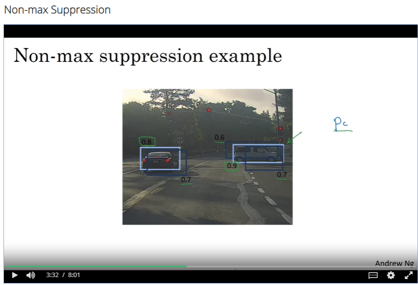

## Screenshots from the lectures 

  
  
  
**You can use a log likelihood loss for C1, C2 and C3. For the bounding box outputs you can use squared error or something like squared error. For Pc you can use a logistic regression loss**
  
**The identity of the landmark points must be consistent across different images. For instance l1x,l1y is the left corner of the left eye (when looking at the image)**
  
**The training set is closely cropped - the car takes up all of the image without much background**
  
**The sliding windows method is computationally costly. Small strides require more computation, while larger have poorer performance**
  
  
  
  
  
  
  
**What non-max suppression does, is it cleans up these detections. So they end up with just one detection per car, rather than multiple detections per car**
  
  
  
