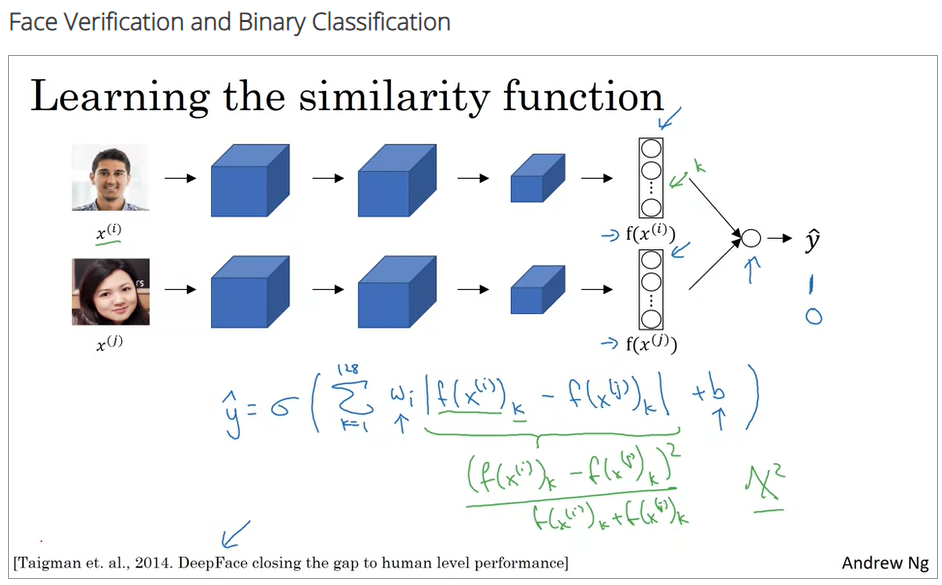

## Screenshots from the lectures 

  
  
  
  
  
  
  
  
  
  
  
  
  
  
  
  
  
  
  
  
  
  
  
  
**So just to finish up, this is the style cost function defined using layer l and as you saw on the previous slide, this is basically the Frobenius norm between the two star matrices computed on the image s and on the image G Frobenius on squared and never by the just low normalization constants, which isn't that important. And, finally, it turns out that you get more visually pleasing results if you use the style cost function from multiple different layers. So, the overall style cost function, you can define as sum over all the different layers of the style cost function for that layer. We should define the book weighted by some set of parameters, by some set of additional hyperparameters, which we'll denote as lambda l here. So what it does is allows you to use different layers in a neural network. Well of the early ones, which measure relatively simpler low level features like edges as well as some later layers, which measure high level features and cause a neural network to take both low level and high level correlations into account when computing style.** 
  
  

## Quiz  

  
  
  
  
  
  
  
