## Screenshots from the lectures 

 **Pretty good article on [Attention Models](https://blog.floydhub.com/attention-mechanism/)** 
 **And a series on [Transformers](https://towardsdatascience.com/transformers-explained-visually-part-1-overview-of-functionality-95a6dd460452)**  

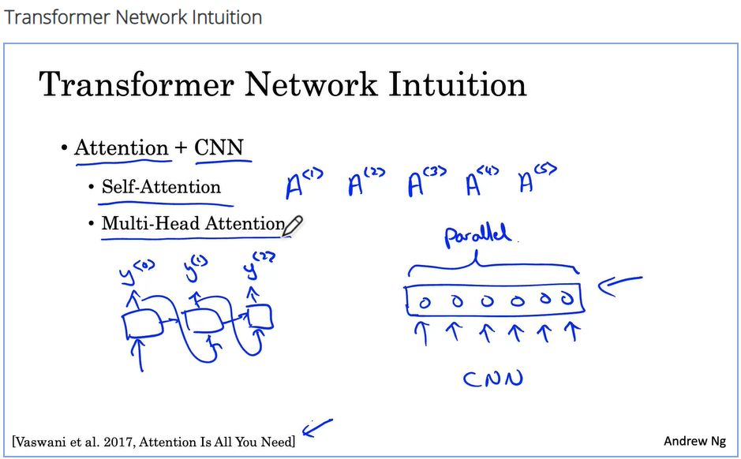  
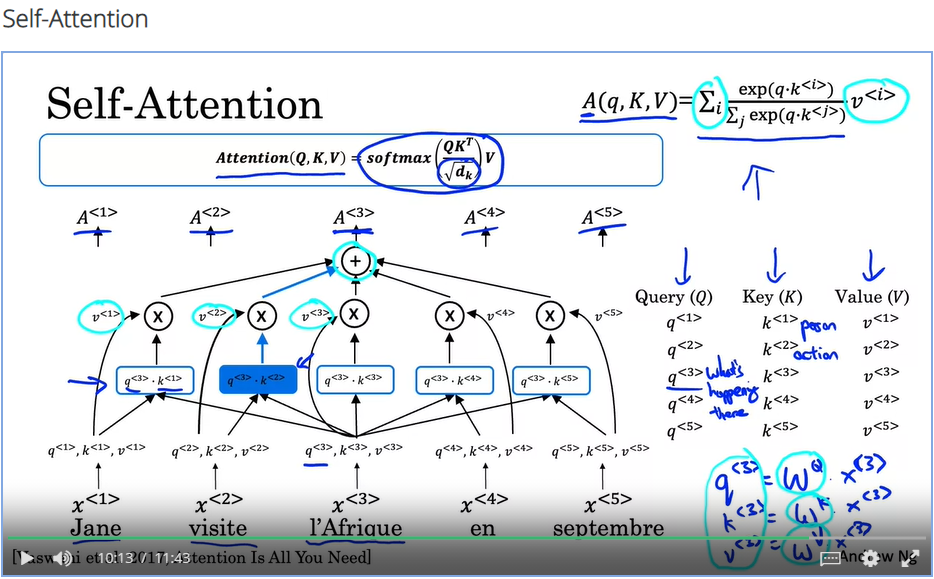  
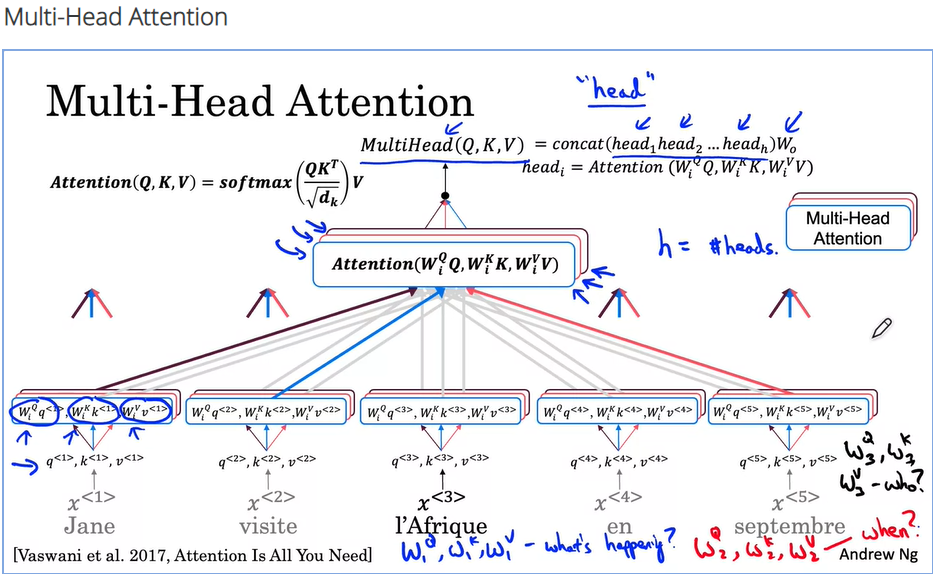  
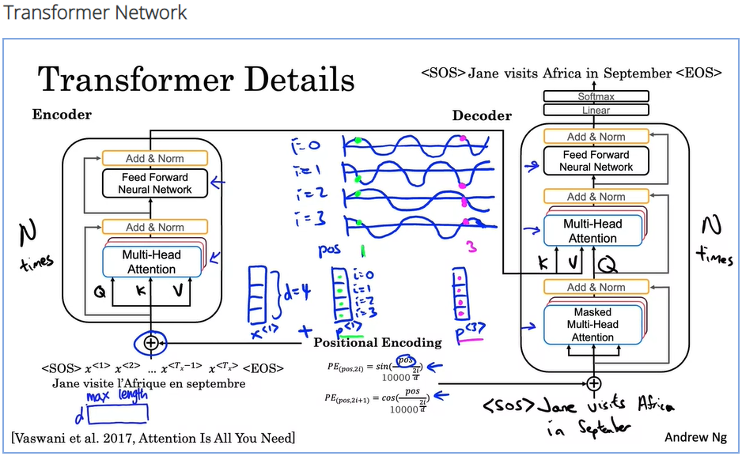  

## Quiz  

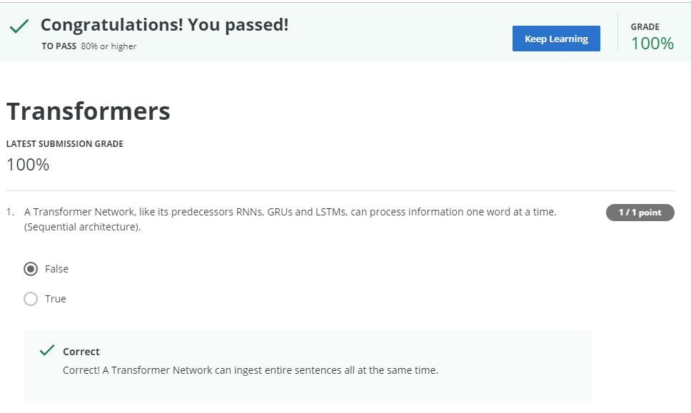  
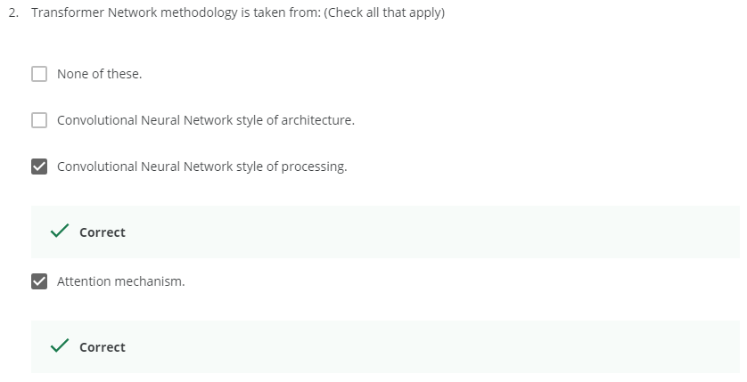  
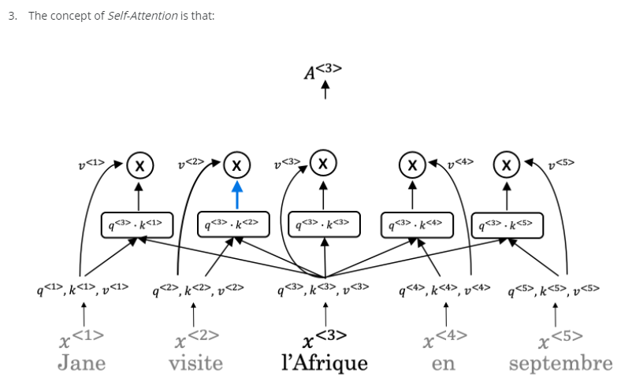  
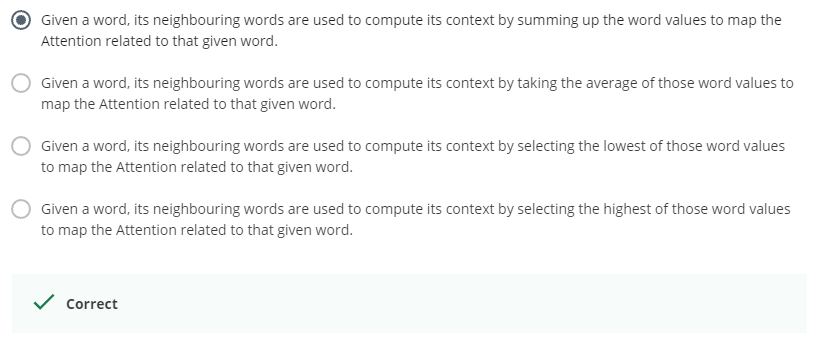  
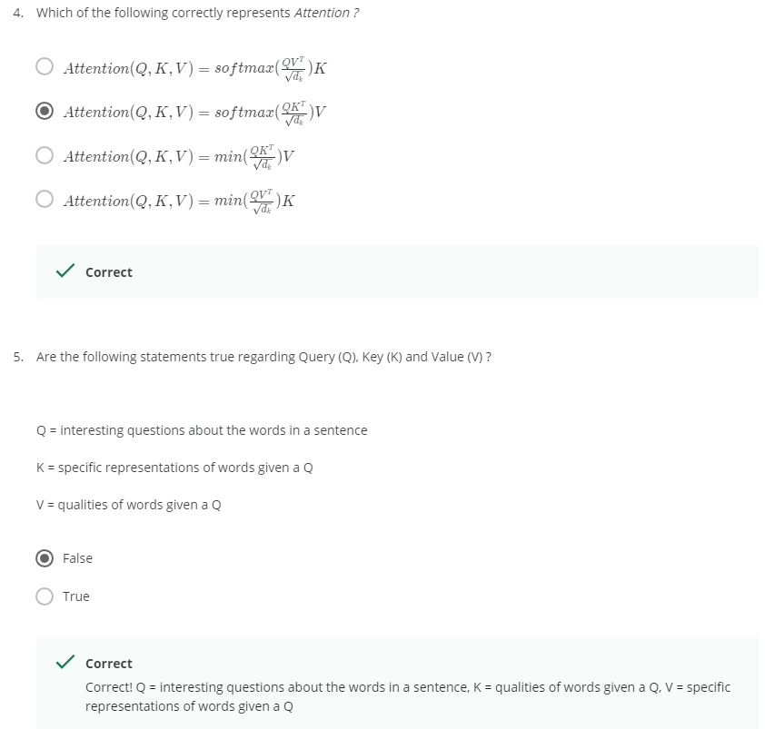  
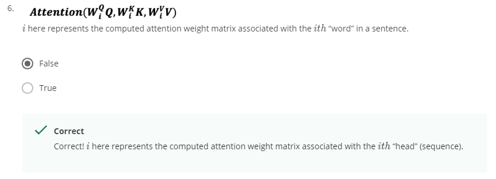  
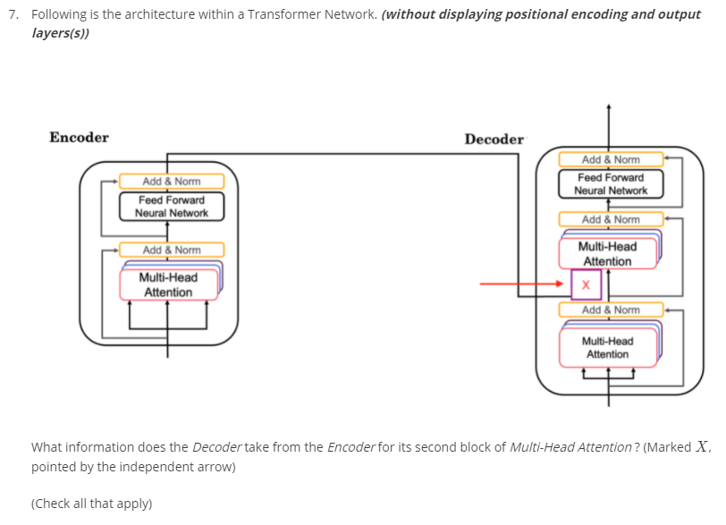  
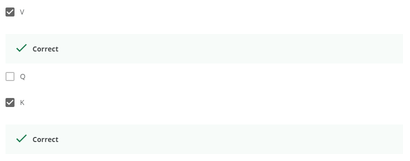  
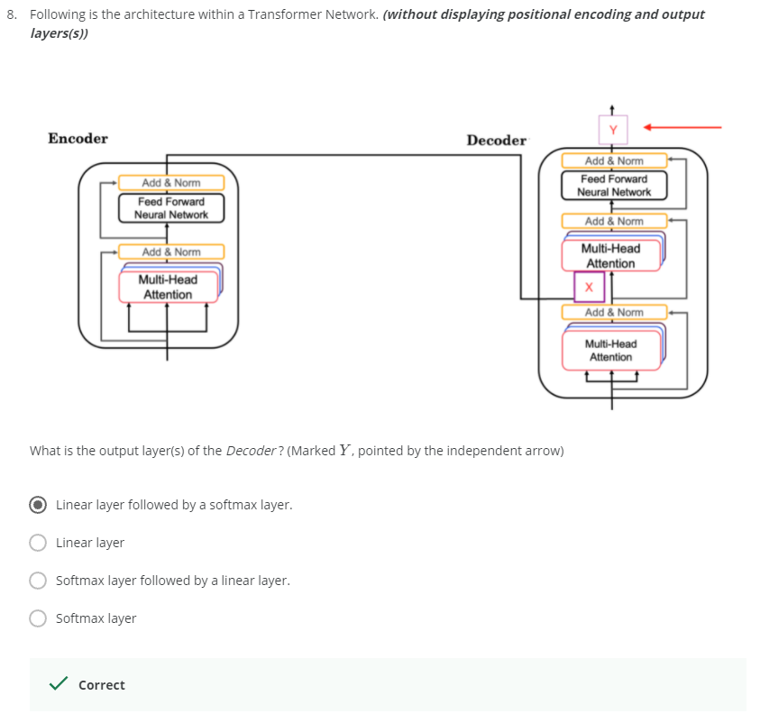  
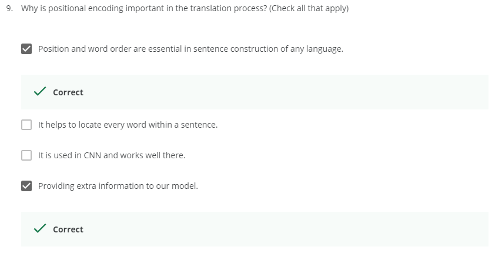  
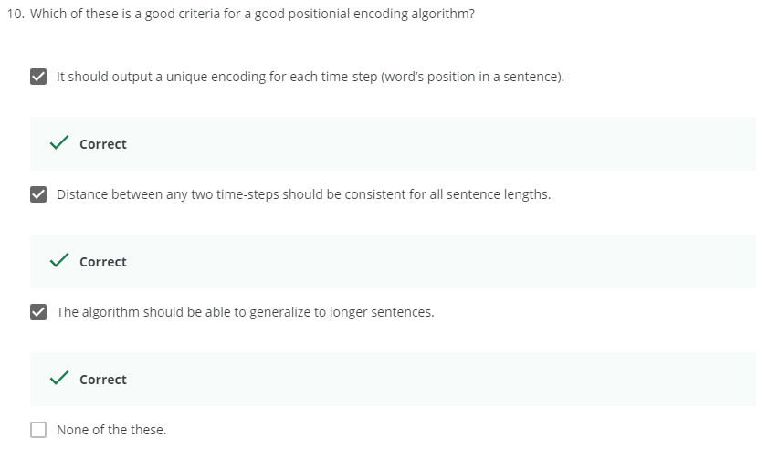  
